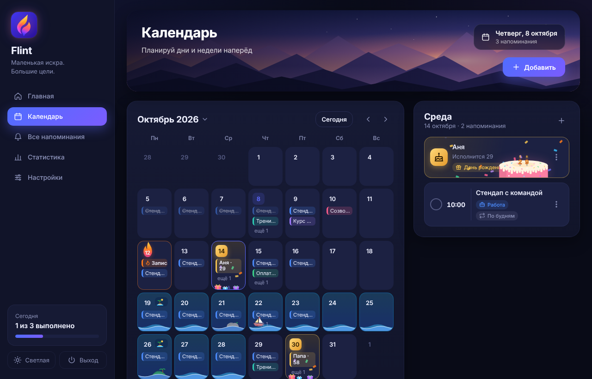
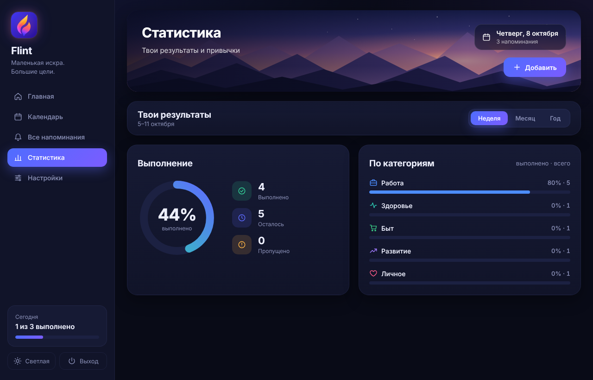

# Flint

**Маленькая искра. Большие цели.**
<br clear="left">


Flint — десктопное приложение-напоминалка для Windows: календарь, категории, отметки «выполнено» и статистика.
Интерфейс на HTML/CSS, логика на Python, окно через [pywebview](https://pywebview.flowrl.com/).


## Возможности

- **Главная** — приветствие, календарь месяца, список на сегодня и ближайшие дни
- **Напоминания** — описание, категории (Работа, Здоровье, Личное, Быт, Развитие), 🔥 приоритет
- **Повторы** — разово, каждый день, по будням, раз в неделю, каждый месяц, каждый год
- **🎂 Дни рождения** — возраст, напоминания в сам день / за день / за неделю; золотые дни с подарками и конфетти,
  торт со свечами-цифрами (свечу можно «задуть» мышкой) и салют при добавлении
- **🏖 Отпуск** — диапазон дат, море с волнами, корабликом и островами в календаре, пляж с солнцем, чайками и крабом;
  пересекающиеся отпуска сливаются в одно море, можно не напоминать о рабочем
- **Выбор месяца** — одна кнопка «Октябрь 2026 ▾», на плитках месяцев видно 🎂 / 🏖 / 🔥
- **Выполнено** — галочка у каждого напоминания, для повторяющихся отмечается конкретный день
- **Заметки** — папки, теги, избранное, поиск по тексту; оформление (чек-листы, списки, блок-идея) поверх Markdown;
  выделил текст — получил напоминание с датой из слов («в понедельник», «завтра в 15:00»); шаблоны, экспорт в .md/.txt/zip,
  история версий; удаление ползунком «Сдвинь, чтобы удалить» — заметка сгорает
- **Статистика** — процент выполнения, «осталось» и «пропущено», разбивка по категориям за неделю/месяц/год
- **Уведомление** — окно поверх всех в углу экрана: «Открыть», «Выполнено», «Отложить» (5 мин … 2 часа)
- **Анимации** — подсветка переливается лавой «из стакана», искры, «сгорающая» смена темы
  (эффект и скорость настраиваются; «живые картинки» — море, пляж, свечи — можно остановить отдельно)
- **Обращение** — мужское, женское или нейтральное: фразы подстраиваются
- Тёмная и светлая тема, автозапуск с Windows (сразу в трей)
- Крестик прячет Flint в трей (значок-огонёк у часов) — напоминания продолжают работать; полный выход — «Выход»

| Календарь: отпуск | День рождения |
|---|---|
|  |  |
| **Редактор** | **Статистика** |
|  |  |

## Скачать

`Flint.exe` собирается в GitHub Actions — Python для запуска не нужен:

- **Последняя сборка:** *Actions* → последний запуск *Test & Build* → *Artifacts*
- **Релиз:** при пуше тега `v*` (например, `v2.0.0`) exe публикуется в *Releases*

Нужен WebView2 — на Windows 10/11 он обычно уже установлен.

## Где хранятся данные

Все записи (напоминания, дни рождения, отпуска, отметки «выполнено», заметки) и настройки лежат в одном файле на компьютере пользователя:

```
%APPDATA%\Flint\data.json
```

Обычно это `C:\Users\<имя>\AppData\Roaming\Flint\data.json`. Быстро открыть папку: `Win + R` → `%APPDATA%\Flint` → Enter.

- Данные хранятся отдельно от `Flint.exe`: можно скачать новую версию, переименовать или переместить exe — записи останутся.
- **Резервная копия:** просто скопируй `data.json` в надёжное место (облако, флешка).
- **Восстановление / перенос на другой компьютер:** закрой Flint через «Выход» (крестик только прячет его в трей), положи `data.json` в `%APPDATA%\Flint\` и запусти Flint снова.
- Если удалить файл, Flint начнёт с чистого листа.
- Это обычный JSON, но править его вручную не стоит. Если файл окажется повреждён, Flint не затрёт его: отложит рядом копию `data.broken-<дата>.json` и начнёт с чистого листа — из копии всё можно восстановить.
- Данные никуда не отправляются: Flint работает полностью офлайн.

## Разработка

```bash
pip install -r requirements.txt
python app.py                 # приложение
python devserver.py           # интерфейс в браузере: http://127.0.0.1:8765/index.html?dev
```

Тесты (логика + UI в браузере через Playwright):

```bash
pip install -r requirements-dev.txt
python -m playwright install chromium
python -m pytest -v
```

## Структура

| Файл | Что внутри |
|---|---|
| `core.py` | Хранение, повторы, выполнение, уведомления, статистика |
| `api.py` | Методы, которые вызывает интерфейс |
| `app.py` | Окна pywebview, фоновая проверка, всплывающие уведомления |
| `devserver.py` | Запуск интерфейса в браузере для отладки и тестов |
| `ui/` | HTML/CSS/JS интерфейса, `ui/fx.js` — анимации |
| `tests/` | pytest: логика и UI |

## CI/CD

`.github/workflows/build.yml`: тесты на Ubuntu (pytest + Playwright, отчёт JUnit) →
сборка exe на Windows (PyInstaller) → smoke-проверка размера → артефакт и релиз для тегов.

Фирменный стиль (иконка, палитра) — [docs/design/brand.png](docs/design/brand.png), векторная иконка — `assets/icon.svg`.

Планы, в том числе мобильная версия, — в [ROADMAP.md](ROADMAP.md).
