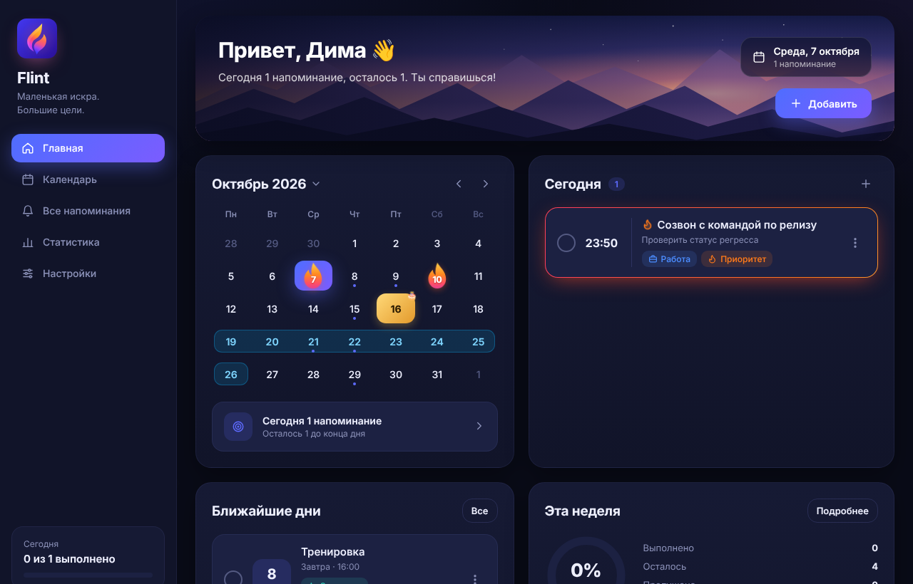

# Flint

**Маленькая искра. Большие цели.**
<br clear="left">


Flint — десктопное приложение-напоминалка для Windows: календарь, категории, отметки «выполнено» и статистика.
Интерфейс на HTML/CSS, логика на Python, окно через [pywebview](https://pywebview.flowrl.com/).



## Возможности

- **Главная** — приветствие, календарь месяца, список на сегодня и ближайшие дни
- **Напоминания** — описание, категории (Работа, Здоровье, Личное, Быт, Развитие), 🔥 приоритет
- **Повторы** — разово, каждый день, по будням, раз в неделю, каждый месяц, каждый год
- **🎂 Дни рождения** — возраст, напоминания в сам день / за день / за неделю, золотые дни с конфетти
- **🏖 Отпуск** — диапазон дат, море с волнами в календаре, можно не напоминать о рабочем
- **Выбор месяца** — одна кнопка «Октябрь 2026 ▾», на плитках месяцев видно 🎂 / 🏖 / 🔥
- **Выполнено** — галочка у каждого напоминания, для повторяющихся отмечается конкретный день
- **Статистика** — процент выполнения, «осталось» и «пропущено», разбивка по категориям за неделю/месяц/год
- **Уведомление** — окно поверх всех в углу экрана: «Открыть», «Выполнено», «Отложить»
- **Анимации** — подсветка переливается лавой «из стакана», искры, круговая смена темы
  (эффект и скорость настраиваются, можно выключить)
- **Обращение** — мужское, женское или нейтральное: фразы подстраиваются
- Тёмная и светлая тема, автозапуск с Windows
- Крестик сворачивает окно, напоминания продолжают работать; полный выход — кнопка «Выход»

| Календарь: день рождения и отпуск | День рождения |
|---|---|
|  |  |

## Скачать

`Flint.exe` собирается в GitHub Actions — Python для запуска не нужен:

- **Последняя сборка:** *Actions* → последний запуск *Test & Build* → *Artifacts*
- **Релиз:** при пуше тега `v*` (например, `v2.0.0`) exe публикуется в *Releases*

Нужен WebView2 — на Windows 10/11 он обычно уже установлен.

## Разработка

```bash
pip install -r requirements.txt
python app.py                 # приложение
python devserver.py           # интерфейс в браузере: http://127.0.0.1:8765/index.html?dev
```

Тесты (логика + UI в браузере через Playwright):

```bash
pip install -r requirements-dev.txt
python -m playwright install chromium
python -m pytest -v
```

## Структура

| Файл | Что внутри |
|---|---|
| `core.py` | Хранение, повторы, выполнение, уведомления, статистика |
| `api.py` | Методы, которые вызывает интерфейс |
| `app.py` | Окна pywebview, фоновая проверка, всплывающие уведомления |
| `devserver.py` | Запуск интерфейса в браузере для отладки и тестов |
| `ui/` | HTML/CSS/JS интерфейса, `ui/fx.js` — анимации |
| `tests/` | pytest: логика и UI |

## CI/CD

`.github/workflows/build.yml`: тесты на Ubuntu (pytest + Playwright, отчёт JUnit) →
сборка exe на Windows (PyInstaller) → smoke-проверка размера → артефакт и релиз для тегов.

Фирменный стиль (иконка, палитра) — [docs/design/brand.png](docs/design/brand.png), векторная иконка — `assets/icon.svg`.

Планы, в том числе мобильная версия, — в [ROADMAP.md](ROADMAP.md).
